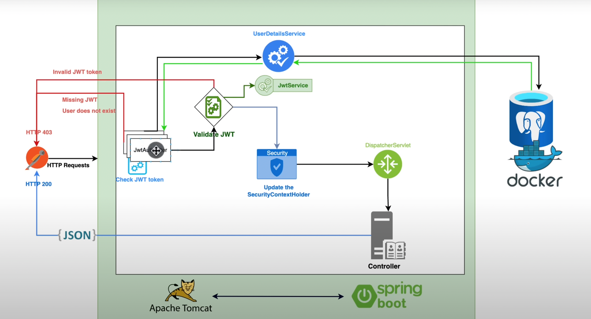

# Spring Boot -- integrated with JWT, connected to H2 database



## Dependencies
- Spring Web
- Spring Security
- Spring Data JPA
- PostgreSQL Driver | H2
- JWT
    ```
        <dependency>
            <groupId>io.jsonwebtoken</groupId>
            <artifactId>jjwt-api</artifactId>
            <version>0.11.5</version>
        </dependency>
        <dependency>
            <groupId>io.jsonwebtoken</groupId>
            <artifactId>jjwt-impl</artifactId>
            <version>0.11.5</version>
        </dependency>
        <dependency>
            <groupId>io.jsonwebtoken</groupId>
            <artifactId>jjwt-jackson</artifactId>
            <version>0.11.5</version>
        </dependency>
    ```

## Reference
- [Spring Boot 3 + Spring Security 6 - JWT Authentication and Authorisation](https://youtu.be/KxqlJblhzfI)
- [spring-boot-h2-database](https://www.baeldung.com/spring-boot-h2-database)

## Cr.
**Amigoscode**